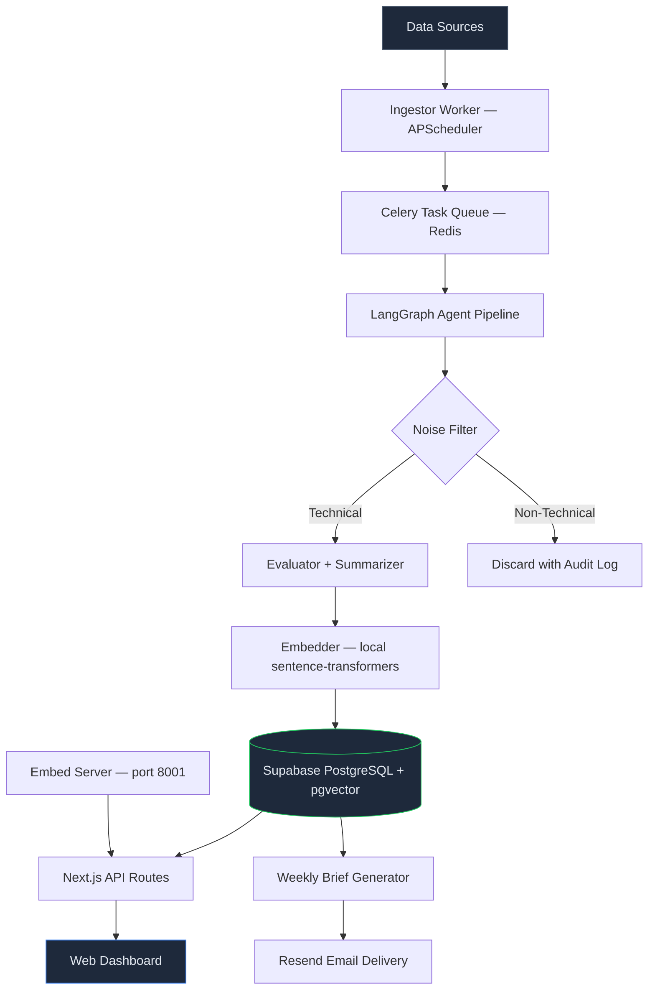
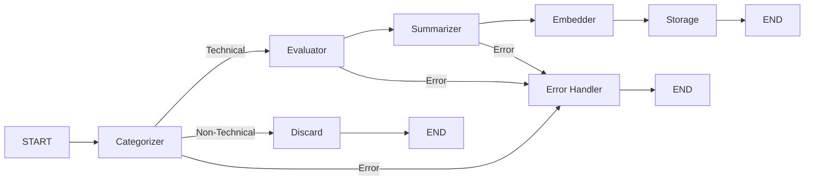

# Technical Architecture: AI News Intelligence Platform

> **Author:** Bryan Escamilla — Applaudo Studios  
> **Stack:** Next.js 16 · Supabase · LangGraph · OpenRouter · Shadcn/UI  
> **Last updated:** April 2026

---

## 1. System Overview

The platform follows a **Modular Monolith** architecture: a Next.js frontend/API layer coupled with an independent **Agentic Pipeline** (Python) for data ingestion and enrichment. Both layers communicate exclusively through the Supabase database — no direct RPC between them. This separation allows the worker to be replaced or scaled without impacting the frontend.



### Data Sources

| Source | Endpoint | Polling Interval |
|--------|----------|-----------------|
| HuggingFace Blog | `huggingface.co/blog/feed.xml` | Every 30 min |
| OpenAI Blog | `openai.com/news/rss.xml` | Every 30 min |
| Google DeepMind | `deepmind.google/blog/rss.xml` | Every 30 min |
| Arxiv (cs.AI, cs.CL) | `export.arxiv.org/api/query` | Every 60 min |
| Hacker News | `hacker-news.firebaseio.com/v0` | Every 60 min |

All sources are public — no API keys required for scraping.

### Design Philosophy

- **Zero paid API calls.** LLM inference via OpenRouter free-tier models; embeddings via a local HTTP server backed by sentence-transformers. The entire stack runs free-of-charge — only a free OpenRouter account is required.
- **Single-user simplicity.** No authentication, no session management. `OWNER_ID = 'owner'` is hardcoded; all routes are implicitly private (local deployment).
- **Graceful degradation.** If OpenRouter rate-limits a model, the `ModelPool` rotates to the next free model automatically. If the embed server is unavailable, `/api/search` returns HTTP 503 with a clear error; the news feed and all other pages continue working normally.

---

## 2. Technology Stack

### Frontend & API Layer

| Component | Technology | Version | Purpose |
|-----------|-----------|---------|---------|
| Framework | Next.js (App Router) | 16.2+ | Server rendering, API routes, Turbopack |
| UI Library | Shadcn/UI + @base-ui/react | Latest | Accessible, customizable component primitives |
| Styling | Tailwind CSS | v4 | Utility-first CSS, dark mode default |
| State | TanStack React Query | v5 | Server state caching, optimistic updates |
| Markdown | react-markdown + shiki | Latest | Syntax-highlighted code blocks in summaries |
| Language | TypeScript | 5.x | Full type safety across frontend |

### Agentic Pipeline (Python Worker)

| Component | Technology | Purpose |
|-----------|-----------|---------|
| Runtime | Python 3.11+ | LLM/ML ecosystem |
| Agent Framework | LangGraph 0.2+ | Stateful directed graph with retry and fallback edges |
| LLM — Categorizer | `google/gemma-4-31b-it:free` via OpenRouter | First-pass technical noise filter ($0) |
| LLM — Evaluator | `nvidia/nemotron-3-super-120b-a12b:free` via OpenRouter | Scoring and tag assignment ($0) |
| LLM — Summarizer | `nvidia/nemotron-3-super-120b-a12b:free` via OpenRouter | Technical summaries + implementation steps ($0) |
| LLM Client | `openai` Python SDK | Pointed at `https://openrouter.ai/api/v1` (OpenAI-compatible) |
| Embeddings | `sentence-transformers/all-MiniLM-L6-v2` | Local, 384 dims, ~80 MB cached model, no API key |
| Embed Server | `worker/embed_server.py` on port 8001 | Bridges local model to Next.js `/api/search` |
| Rate-limit Retry | `_openrouter_chat()` wrapper | Exponential backoff (5s→10s→20s) on 429 errors + automatic model rotation |
| Model Pool | `ModelPool` class | Thread-safe round-robin across 9 free models (3 pools: categorizer, evaluator, summarizer) |
| Daily Token Cap | `DAILY_TOKEN_CAP` env var | Enforced per-call check against `llm_usage_log` — blocks new LLM calls when budget is exhausted |
| Job Queue | Celery 5+ with Redis broker | Retries, rate limits, task concurrency |
| Scheduler | APScheduler | In-process cron for polling each source |
| HTTP Client | httpx + feedparser | Async RSS/API fetching |
| Input Sanitization | bleach | Strips HTML/JS before sending content to LLMs |
| XML Security | defusedxml | Protects against XML bomb attacks from RSS feeds |

### Infrastructure

| Component | Technology | Cost |
|-----------|-----------|------|
| Primary DB | Supabase (PostgreSQL 15 + pgvector) | Free |
| Vector Search | pgvector (384 dims, IVFFlat index) | Co-located with DB |
| Job Queue Broker | Redis (Docker container) | Free |
| Email | Resend (optional, weekly brief only) | Free (100/day) |
| Frontend Hosting | Vercel (Hobby) | Free |
| Worker Hosting | Railway (Docker) | ~$5–10/month |
| CI/CD | GitHub Actions | Free |

**Total operational cost: ~$5–10/month** (Railway container only).

---

## 3. Database Schema

All data lives in a single Supabase PostgreSQL instance with the `pgvector` extension enabled.

### Tables

```
news_items              — Articles ingested and enriched by the pipeline
tech_tags               — Controlled vocabulary of technical tags
news_item_tags          — Many-to-many: articles ↔ tags
user_watchlist          — Single-owner technology watchlist
email_subscriptions     — Subscribers for the weekly email digest (optional)
llm_usage_log           — Token usage tracking per LLM call
```

### Key Columns (news_items)

| Column | Type | Description |
|--------|------|-------------|
| `id` | UUID | Primary key |
| `source_url` | TEXT (UNIQUE) | Deduplication key |
| `source_name` | TEXT | `'huggingface'` · `'openai'` · `'arxiv'` · `'deepmind'` · `'hn'` |
| `title` | TEXT | Article title |
| `raw_content` | TEXT | HTML-stripped plain text |
| `technical_summary` | TEXT | LLM-generated Markdown summary |
| `impact_score` | SMALLINT (1–10) | Developer workflow impact |
| `depth_score` | SMALLINT (1–10) | Technical complexity |
| `implementation_steps` | JSONB | Step-by-step implementation guide |
| `affected_workflows` | TEXT[] | e.g., `['RAG Pipelines', 'Agent Orchestration']` |
| `embedding` | VECTOR(384) | all-MiniLM-L6-v2; set at ingestion |
| `category` | TEXT | `'Technical'` · `'Financial'` · `'Political'` · `'General'` |
| `tags` | TEXT[] | Denormalized tag names for fast list queries |
| `is_filtered` | BOOLEAN | `TRUE` = passed noise filter, visible in dashboard |
| `archived` | BOOLEAN | `TRUE` = archived by data retention policy |

### Semantic Search RPC

```sql
CREATE OR REPLACE FUNCTION match_articles(
  query_embedding VECTOR(384),
  match_count     INT DEFAULT 10,
  filter_id       UUID DEFAULT NULL
)
RETURNS TABLE (
  id UUID, title TEXT, source_name TEXT, source_url TEXT,
  technical_summary TEXT, impact_score SMALLINT, depth_score SMALLINT,
  tags TEXT[], published_at TIMESTAMPTZ, similarity FLOAT
)
LANGUAGE sql STABLE AS $$
  SELECT id, title, source_name, source_url, technical_summary,
         impact_score, depth_score, tags, published_at,
         1 - (embedding <=> query_embedding) AS similarity
  FROM news_items
  WHERE is_filtered = TRUE AND archived = FALSE
    AND (filter_id IS NULL OR id != filter_id)
  ORDER BY embedding <=> query_embedding
  LIMIT match_count;
$$;
```

### Row Level Security

| Table | Policy | Details |
|-------|--------|---------|
| `news_items` | `public_read_filtered` | SELECT only where `is_filtered = TRUE` |
| `tech_tags` | `public_read` | Full read access |
| `news_item_tags` | `public_read` | Full read access |
| `user_watchlist` | Service role only | No client-facing policies; API routes use service role key |
| `llm_usage_log` | Service role only | No client access; written by worker |

### Data Retention (Automated)

| Policy | Retention | Schedule |
|--------|-----------|----------|
| Discarded articles (`is_filtered = FALSE`) | 30 days | Daily at 03:00 UTC |
| LLM usage logs | 90 days | Daily at 03:00 UTC |
| Old articles | Archived after 6 months | Daily at 03:00 UTC |

---

## 4. LangGraph Agent Pipeline

The pipeline is a directed stateful graph that processes each article through classification, evaluation, summarization, and embedding.



### Pipeline State

```python
class PipelineState(TypedDict):
    source_url: str
    source_name: str
    title: str
    raw_content: str
    published_at: str | None
    category: Literal["Technical", "Financial", "Political", "General", "Error"]
    depth_score: int
    impact_score: int
    affected_workflows: list[str]
    tags: list[str]
    technical_summary: str
    implementation_steps: list[dict]
    embedding: list[float]
    error: str | None
```

### Node Responsibilities

| Node | Model | Cost | Purpose |
|------|-------|------|---------|
| `categorizer_node` | ModelPool: `gemma-4-31b-it`, `nemotron-nano-9b`, `nemotron-3-nano-30b` | $0 | Classify article category. Runs on ALL articles. |
| `evaluator_node` | ModelPool: `nemotron-3-super-120b`, `gpt-oss-120b`, `minimax-m2.5` | $0 | Assign scores, workflows, and tags. Technical articles only. |
| `summarizer_node` | ModelPool: `nemotron-3-super-120b`, `gpt-oss-120b`, `minimax-m2.5` | $0 | Generate Markdown summary + implementation steps. |
| `embedder_node` | `all-MiniLM-L6-v2` (local) | $0 | Generate 384-dim embedding vector. No network call. |
| `storage_node` | Supabase | — | Upsert record with `is_filtered=TRUE`. Insert tags. Log usage. |
| `discard_node` | Supabase | — | Store minimal record with `is_filtered=FALSE`. |
| `error_node` | Supabase | — | Store raw article. Raise Celery RetryError (max 3×, exponential backoff). |

### Resilience

- **Celery retries:** Up to 3× per article with exponential backoff (5s → 10s → 20s).
- **OpenRouter rate-limit retry:** `_openrouter_chat()` wrapper retries up to 4× with exponential backoff (5s → 10s → 20s → 40s) on HTTP 429 responses. On 429, the active model is automatically rotated to the next in the pool.
- **ModelPool rotation:** Each role (categorizer, evaluator, summarizer) has a thread-safe `ModelPool` with 3 free OpenRouter models. On rate-limit, the pool rotates to the next model instantly.
- **LLM JSON parsing:** Resilient `_parse_llm_json()` helper strips markdown fences and extracts JSON from mixed-content LLM responses.
- **Daily token cap:** `_check_daily_token_cap()` queries `llm_usage_log` for today's total tokens before every LLM call. If `DAILY_TOKEN_CAP` (default 400,000) is exceeded, raises `DailyTokenCapExceeded` to prevent further API calls. Set to 0 to disable.
- **Frontend unaffected:** During outages, the dashboard serves cached `is_filtered = TRUE` articles without interruption.

---

## 5. Frontend Architecture

### Route Map

```
app/
├── layout.tsx                    # Root: QueryProvider, dark mode, Cmd+K listener
├── page.tsx                      # /  → News feed (impact_score DESC)
├── article/[id]/page.tsx         # /article/:id → Technical detail view
├── search/page.tsx               # /search → Semantic search results
├── watchlist/page.tsx            # /watchlist → Technology watchlist
├── admin/usage/page.tsx          # /admin/usage → LLM token usage dashboard
└── api/
    ├── news/route.ts             # GET → Paginated articles (is_filtered=TRUE)
    ├── search/route.ts           # GET ?q= → Embed server → pgvector similarity
    ├── article/[id]/route.ts     # GET → Single article
    ├── article/[id]/related/     # GET → Top 5 by vector similarity
    │   └── route.ts
    ├── watchlist/route.ts        # GET / POST / DELETE (OWNER_ID='owner')
    ├── tags/route.ts             # GET → Dynamic tags list (from tech_tags table)
    ├── email-subscribe/route.ts  # GET status / POST subscribe (email + owner upsert)
    ├── unsubscribe/route.ts      # GET → HMAC-validated unsubscribe, returns HTML
    └── admin/usage/route.ts      # GET → Token usage data (service role)
```

### Key Components

| Component | Purpose |
|-----------|---------|
| `NewsFeed` | Infinite-scroll article list sorted by impact score. Dynamic tag filtering via `/api/tags`. Capped at 20 pages with truncation indicator. |
| `EmailSubscribe` | Inline subscribe form for weekly brief. React Query for state. Shows active status or input form. |
| `ArticleCard` | Compact card: title, source badge, score bars, top 3 tags, relative time. |
| `CodeBlock` | Syntax-highlighted code via shiki with secure `hast-util-to-jsx-runtime` rendering (no `dangerouslySetInnerHTML`). |
| `CommandPalette` | Cmd+K / Ctrl+K modal. 300ms debounce. Graceful empty state if embed server unavailable. |
| `WatchlistManager` | Tag picker with toggle. Writes via API route with `OWNER_ID='owner'`. |

### Embed Server

The embed server (`worker/embed_server.py`) is a lightweight HTTP server (Python stdlib `http.server`) that exposes the local sentence-transformers model for frontend semantic search.

| Endpoint | Method | Response |
|----------|--------|----------|
| `/health` | GET | `{"ok": true, "model": "all-MiniLM-L6-v2"}` — actually encodes text to verify model works. Returns 503 if model fails. |
| `/embed` | POST `{"text": "..."}` | `{"embedding": [...]}` (384 floats) |

- Binds to `127.0.0.1:8001` by default (configurable via `EMBED_BIND` env var)
- Model lazy-loaded on first request, kept in memory
- Docker `HEALTHCHECK` pings `/health` every 30s with 30s start period
- If unavailable, `/api/search` returns HTTP 503 with error message

---

## 6. Security Model

| Measure | Implementation |
|---------|---------------|
| **API key isolation** | `OPENROUTER_API_KEY` and `SUPABASE_SERVICE_ROLE_KEY` are server-side only. Never in client bundles. |
| **Input sanitization** | All scraped HTML/RSS content is stripped with `bleach.clean(tags=[], strip=True)` before LLM processing. |
| **XML protection** | RSS response size capped at 2 MB (`MAX_RSS_RESPONSE_BYTES`). `defusedxml` dependency for XML bomb prevention. |
| **XSS prevention** | Code blocks rendered via `hast-util-to-jsx-runtime` instead of `dangerouslySetInnerHTML`. |
| **Security headers** | `X-Content-Type-Options: nosniff`, `X-Frame-Options: DENY`, `Referrer-Policy: strict-origin-when-cross-origin`, `Permissions-Policy` (camera, mic, geolocation denied), `Content-Security-Policy` (`default-src 'self'`, `frame-ancestors 'none'`, `connect-src` Supabase). |
| **Deployment guard** | `requireSupabase()` in `lib/guards.ts` returns HTTP 503 if Supabase env vars are missing (e.g., during Vercel builds). Applied to all 6 API routes. |
| **Cache-Control** | API routes set proper caching: `s-maxage=60` for news/search, `s-maxage=300` for articles, `no-store` for private data (watchlist, admin). |
| **Error sanitization** | Server errors logged with full detail; client responses receive generic messages only. |
| Network isolation | Embed server and Redis bind to `127.0.0.1` only. Non-essential Supabase services (Studio, Mailpit, Analytics) excluded from startup. Worker Dockerfile runs as non-root user. |
| **RLS enforcement** | Supabase RLS ensures clients can only read `is_filtered = TRUE` articles. Writes require service role key. |
| **Rate limiting** | In-memory sliding-window rate limiter on all API routes (10-60 req/min per endpoint). HN scraper throttled with `Semaphore(20)`. Infinite scroll capped at 20 pages. |
| **Error tracking** | Sentry integration for both Next.js (`@sentry/nextjs`) and Python worker (`sentry-sdk`). DSNs via env vars — no-op when unset. |
| **Structured logging** | `structlog` with JSON output in production (`LOG_FORMAT=json`), colored console in development. |
| **ARIA accessibility** | All interactive components have proper `role`, `aria-label`, `aria-pressed`, and `aria-live` attributes. |
| **No auth surface** | Single-user design eliminates session fixation, JWT forgery, and credential stuffing vectors. |

---

## 7. Environment Variables

### `.env.local` (Next.js Frontend)

| Variable | Required | Purpose |
|----------|----------|---------|
| `NEXT_PUBLIC_SUPABASE_URL` | Yes | Supabase instance URL |
| `SUPABASE_SERVICE_ROLE_KEY` | Yes | Server-side DB access (bypasses RLS) |
| `WORKER_EMBED_URL` | No | Embed server URL (default: `http://localhost:8001`) |
| `NEXT_PUBLIC_APP_URL` | No | App base URL || `NEXT_PUBLIC_SENTRY_DSN` | No | Sentry DSN for Next.js error tracking |
| `SENTRY_AUTH_TOKEN` | No | Sentry auth token for source map upload (production builds) |
### `worker/.env` (Python Pipeline)

| Variable | Required | Purpose |
|----------|----------|---------|
| `SUPABASE_URL` | Yes | Supabase URL |
| `SUPABASE_SERVICE_ROLE_KEY` | Yes | DB write access |
| `OPENROUTER_API_KEY` | Yes | Free key from [openrouter.ai/keys](https://openrouter.ai/keys) |
| `CELERY_BROKER_URL` | Yes | `redis://localhost:6379/0` |
| `CELERY_RESULT_BACKEND` | Yes | `redis://localhost:6379/0` |
| `DAILY_TOKEN_CAP` | No | Max tokens/day before auto-pause (default: 400,000) |
| `RESEND_API_KEY` | No | Weekly email digest (optional) |
| `HMAC_SECRET` | No | HMAC-SHA256 key for unsubscribe tokens (weekly brief) |
| `SENTRY_WORKER_DSN` | No | Sentry DSN for Python worker error tracking |
| `LOG_FORMAT` | No | `json` (production) or `dev` (colored console). Default: `dev` |
| `LOG_LEVEL` | No | Python log level. Default: `INFO` |

---

## 8. CI/CD Pipeline

```yaml
# .github/workflows/ci.yml — runs on push to main/dev and all PRs
jobs:
  frontend:          # pnpm install → typecheck → lint → vitest (65 tests: 33 API + 25 components + 7 infra)
  pipeline:          # pip install → pytest scrapers + embed server + daily cap (24 unit tests, no API keys)
  pipeline-accuracy: # pytest categorizer accuracy (main branch only, requires API keys — 3 tests)
  docker:            # docker build validation (no push)
```

### Quality Gates

| Check | Tool | Threshold |
|-------|------|----------|
| Type safety | `tsc --noEmit` | Zero errors |
| Linting | ESLint 9 | Zero warnings |
| Frontend tests | vitest | 65 tests (33 API routes + 25 React components + 7 infrastructure) |
| Scraper + embed + daily cap tests | pytest | 24 tests (RSS, HN, Arxiv, embed server, daily token cap) |
| E2E tests | Playwright | 7 tests (navigation flows) |
| Noise filter accuracy | pytest | 3 tests, ≥95% pass rate (main branch only, requires API keys) |
| Docker build | `docker build` | Image builds successfully |

---

## 9. Deployment Topology

| Environment | Frontend | Worker | Database |
|-------------|----------|--------|----------|
| Development | `localhost:3000` | Docker Compose (2 terminals) or local venv (5 terminals) | Supabase CLI local instance |
| Production | Vercel (Hobby) | Railway (Docker) | Supabase cloud project |

### Worker Dockerfile

```dockerfile
FROM python:3.11-slim
WORKDIR /app
RUN useradd --create-home worker
COPY requirements.txt .
RUN pip install --no-cache-dir --extra-index-url https://download.pytorch.org/whl/cpu -r requirements.txt
RUN python -c "from sentence_transformers import SentenceTransformer; SentenceTransformer('all-MiniLM-L6-v2')"
COPY . .
USER worker
CMD ["python", "-m", "worker.main"]
```

> **Nota:** Se usa PyTorch CPU-only (`torch==2.11.0+cpu`) en lugar del build CUDA, lo que reduce la imagen del worker en ~3 GB.

### Frontend Dockerfile

```dockerfile
FROM node:22-slim
WORKDIR /app
RUN corepack enable && corepack prepare pnpm@latest --activate
COPY package.json pnpm-lock.yaml pnpm-workspace.yaml ./
RUN pnpm install --frozen-lockfile
COPY . .
RUN useradd --create-home --shell /bin/bash --uid 1001 nextjs
USER nextjs
EXPOSE 3000
CMD ["pnpm", "dev", "--hostname", "0.0.0.0"]
```

> Used by `docker-compose.yml` for the frontend service. Runs as non-root user with hot-reload support.

---

## 10. Cost Summary

| Service | Monthly Cost |
|---------|-------------|
| Supabase (PostgreSQL + pgvector) | $0 |
| Vercel (frontend hosting) | $0 |
| Redis (local Docker) | $0 |
| OpenRouter LLM inference | **$0** (free-tier models) |
| Embeddings (local sentence-transformers) | **$0** |
| Resend (weekly email digest) | $0 (100 emails/day free) |
| Railway (worker container) | ~$5–10 |
| **Total** | **~$5–10/month** |
