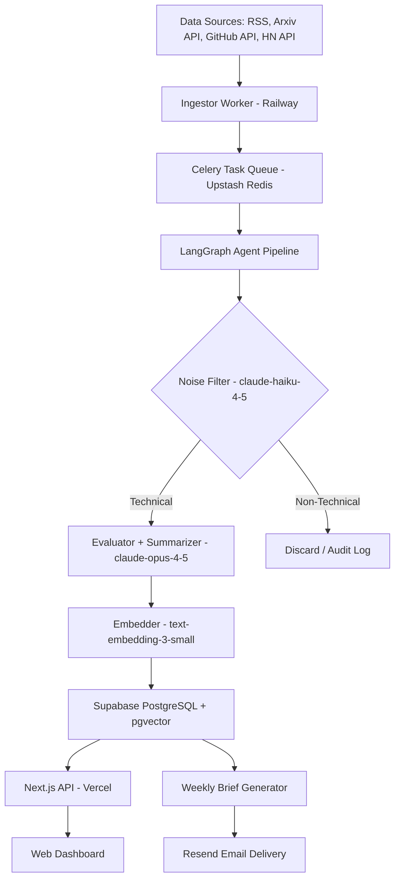

# Technical Architecture: AI Intelligence & News Aggregator

Canonical technical reference for the platform. See [PRD.md](PRD.md) for requirements and [PLAN.md](PLAN.md) for the implementation roadmap.

## 1. System Overview

**Modular Monolith** for the Next.js frontend/API layer + independent **Agentic Pipeline** for data processing. Both services communicate exclusively through the Supabase database — no direct RPC between them. This keeps the worker fully replaceable without touching the frontend.



## 2. Technology Stack

### Frontend & Core API

| Component | Technology | Notes |
|---|---|---|
| Framework | Next.js 15+ (App Router) | Server Actions, Route Handlers, edge-compatible |
| Styling | Tailwind CSS + Shadcn/UI | Dark mode default, information-dense layout |
| State Management | TanStack React Query v5 | Optimistic updates, stale-while-revalidate |
| Auth | Clerk | OAuth (Google + GitHub); JWT forwarded to Supabase RLS |

### Agentic Pipeline (Python Worker)

| Component | Technology | Notes |
|---|---|---|
| Language | Python 3.11+ | Best ecosystem for LLM and scraping libraries |
| Agent Framework | LangGraph 0.2+ | Stateful graph with retry and fallback edges |
| LLM — Categorizer | Claude `claude-haiku-4-5` | Fast, cheap first-pass filter (~$0.0003/article) |
| LLM — Evaluator + Summarizer | Claude `claude-opus-4-5` | Called only on Technical articles (~$0.017/article total) |
| Embeddings | OpenAI `text-embedding-3-small` | 1536 dims, $0.02/MTok |
| HTTP Client | `httpx` + `feedparser` | Async RSS parsing |
| Job Queue Consumer | Celery 5+ (`celery[redis]`) with Upstash Redis broker | Handles retries, rate limits, and task concurrency natively in Python |
| Scheduler | APScheduler | In-process cron for polling each source |
| Observability | LangSmith | Traces all LangGraph runs; set `LANGCHAIN_TRACING_V2=true` |

### Data & Infrastructure

| Component | Technology | Notes |
|---|---|---|
| Primary DB | Supabase (PostgreSQL 15) | Managed, free tier sufficient for MVP |
| Vector Search | pgvector (1536 dims) | Co-located with primary DB, no separate vector service |
| Job Queue Broker | Upstash Redis | Serverless Redis; free 10K commands/day |
| Email | Resend | `resend` Python/Node SDK; 100 emails/day free |
| FE Deployment | Vercel (Hobby) | Zero-config, edge CDN |
| Worker Deployment | Railway | Docker container, always-on ~$5–10/month |
| CI/CD | GitHub Actions | Lint, type-check, pipeline integration tests on every PR |

## 3. Database Schema

```sql
-- Enable pgvector
CREATE EXTENSION IF NOT EXISTS vector;

-- Articles ingested and validated by the pipeline
CREATE TABLE news_items (
  id                   UUID PRIMARY KEY DEFAULT gen_random_uuid(),
  source_url           TEXT UNIQUE NOT NULL,
  source_name          TEXT NOT NULL,           -- 'anthropic' | 'openai' | 'arxiv' | 'deepmind' | 'github' | 'hn'
  title                TEXT NOT NULL,
  raw_content          TEXT,
  technical_summary    TEXT,
  impact_score         SMALLINT CHECK (impact_score BETWEEN 1 AND 10),
  depth_score          SMALLINT CHECK (depth_score BETWEEN 1 AND 10),
  implementation_steps JSONB,                   -- [{"step": 1, "description": "...", "code": "..."}]
  affected_workflows   TEXT[],                  -- e.g. ['RAG Pipelines', 'Agent Orchestration']
  embedding            VECTOR(1536),            -- text-embedding-3-small; set at ingestion, never NULL after pipeline
  category             TEXT,                           -- classification result: 'Technical' | 'Financial' | 'Political' | 'General'
  tags                 TEXT[],                         -- denormalized tag names for fast list queries (source of truth: news_item_tags)
  published_at         TIMESTAMPTZ,
  ingested_at          TIMESTAMPTZ DEFAULT NOW(),
  is_filtered          BOOLEAN NOT NULL DEFAULT FALSE  -- TRUE = passed noise filter and is publicly visible
);

-- Controlled vocabulary of technical tags
CREATE TABLE tech_tags (
  id       UUID PRIMARY KEY DEFAULT gen_random_uuid(),
  name     TEXT UNIQUE NOT NULL,               -- 'LangGraph', 'RAG', 'Claude', 'Multi-Agent', etc.
  category TEXT NOT NULL                       -- 'framework' | 'model' | 'methodology' | 'tool'
);

-- Many-to-many: articles ↔ tags
CREATE TABLE news_item_tags (
  news_item_id UUID NOT NULL REFERENCES news_items(id) ON DELETE CASCADE,
  tech_tag_id  UUID NOT NULL REFERENCES tech_tags(id)  ON DELETE CASCADE,
  PRIMARY KEY (news_item_id, tech_tag_id)
);

-- Per-user technology watchlist (requires Clerk auth)
CREATE TABLE user_watchlist (
  user_id     TEXT NOT NULL,                   -- Clerk user ID (JWT sub claim)
  tech_tag_id UUID NOT NULL REFERENCES tech_tags(id) ON DELETE CASCADE,
  created_at  TIMESTAMPTZ DEFAULT NOW(),
  PRIMARY KEY (user_id, tech_tag_id)
);

-- Email subscribers for the weekly brief
CREATE TABLE email_subscriptions (
  user_id    TEXT PRIMARY KEY,                 -- Clerk user ID
  email      TEXT NOT NULL,
  active     BOOLEAN DEFAULT TRUE,
  created_at TIMESTAMPTZ DEFAULT NOW()
);

-- LLM usage tracking for cost control
CREATE TABLE llm_usage_log (
  id           UUID PRIMARY KEY DEFAULT gen_random_uuid(),
  timestamp    TIMESTAMPTZ DEFAULT NOW(),
  model        TEXT NOT NULL,
  input_tokens INT,
  output_tokens INT,
  job_id       TEXT
);

-- Indexes
CREATE INDEX ON news_items USING ivfflat (embedding vector_cosine_ops) WITH (lists = 100);
CREATE INDEX ON news_items (published_at DESC);
CREATE INDEX ON news_items (impact_score DESC);
CREATE INDEX ON news_items (is_filtered, published_at DESC);
CREATE INDEX ON news_item_tags (tech_tag_id);
CREATE INDEX ON news_item_tags (news_item_id);
```

### Row Level Security (RLS)

```sql
-- news_items: public read only for filtered articles; no client writes
ALTER TABLE news_items ENABLE ROW LEVEL SECURITY;
CREATE POLICY "public_read_filtered" ON news_items
  FOR SELECT USING (is_filtered = TRUE);

-- tech_tags: fully public read
ALTER TABLE tech_tags ENABLE ROW LEVEL SECURITY;
CREATE POLICY "public_read" ON tech_tags FOR SELECT USING (TRUE);

-- news_item_tags: public read
ALTER TABLE news_item_tags ENABLE ROW LEVEL SECURITY;
CREATE POLICY "public_read" ON news_item_tags FOR SELECT USING (TRUE);

-- user_watchlist: users can only read/write their own rows
ALTER TABLE user_watchlist ENABLE ROW LEVEL SECURITY;
CREATE POLICY "own_rows" ON user_watchlist
  USING (user_id = auth.jwt() ->> 'sub');

-- email_subscriptions: users manage their own subscription
ALTER TABLE email_subscriptions ENABLE ROW LEVEL SECURITY;
CREATE POLICY "own_row" ON email_subscriptions
  USING (user_id = auth.jwt() ->> 'sub');

-- llm_usage_log: no client access; written by worker via service role key only
ALTER TABLE llm_usage_log ENABLE ROW LEVEL SECURITY;
-- No SELECT policy = inaccessible from client. Admin reads via service role.
```

## 4. LangGraph Agent Pipeline

Directed stateful graph with explicit error and discard edges.

```python
from typing import TypedDict, Literal

class PipelineState(TypedDict):
    # Populated by the scraper before the graph runs:
    source_url: str
    source_name: str
    title: str
    raw_content: str
    published_at: str | None
    # After categorizer_node:
    category: Literal["Technical", "Financial", "Political", "General", "Error"]
    # After evaluator_node:
    depth_score: int           # Technical complexity: 1–10
    impact_score: int          # Developer workflow impact: 1–10
    affected_workflows: list[str]
    tags: list[str]            # Tag names matched to tech_tags vocabulary
    # After summarizer_node:
    technical_summary: str
    implementation_steps: list[dict]
    # After embedder_node:
    embedding: list[float]
    error: str | None

# Node responsibilities:
# 1. categorizer_node  → claude-haiku-4-5: classify category. Cheap call, runs on ALL articles.
# 2. evaluator_node    → claude-opus-4-5: assigns BOTH depth_score (technical complexity 1-10)
#                        AND impact_score (developer workflow impact 1-10), affected_workflows,
#                        and tags (matched against tech_tags controlled vocabulary).
#                        Runs only on Technical articles.
# 3. summarizer_node   → claude-opus-4-5: technical_summary (markdown) + implementation_steps JSON.
#    CONSTRAINT: only extract code literally present in raw_content. Never hallucinate.
# 4. embedder_node     → OpenAI text-embedding-3-small: generate 1536-dim embedding vector.
# 5. storage_node      → Supabase (service role key): upsert full record, set is_filtered=TRUE.
#                        Inserts tags into news_item_tags join table. Writes to llm_usage_log.
# 6. discard_node      → Inserts minimal record into news_items with is_filtered=FALSE and
#                        category=<classified_category>. No separate table needed — the
#                        LangSmith trace captures the full discard reason automatically.
# 7. error_node        → Stores raw article with is_filtered=FALSE. Raises Celery RetryError
#                        to trigger automatic retry (max 3×, exponential backoff).

# Graph edges:
# START → categorizer_node
# categorizer_node:
#   category == "Technical"  → evaluator_node
#   category != "Technical"  → discard_node → END
# evaluator_node  → summarizer_node
# summarizer_node → embedder_node
# embedder_node   → storage_node → END
# Any node (on exception) → error_node → END
```

**Fallback / Graceful Degradation:** If the Anthropic API is unavailable, nodes raise a retriable exception. Celery retries the task up to 3× with exponential backoff (5s, 10s, 20s) via `self.retry(countdown=5 * (2 ** self.request.retries))`. After 3 failures the article is stored with `is_filtered = FALSE`. The Next.js dashboard serves previously cached `is_filtered = TRUE` articles uninterrupted.

## 5. API Integrations & Scraping Sources

| Source | Endpoint | Auth | Polling Interval | Phase |
|---|---|---|---|---|
| Anthropic Blog | `https://www.anthropic.com/rss.xml` | None | Every 30 min | 1–2 |
| OpenAI Blog | `https://openai.com/news/rss.xml` | None | Every 30 min | 1–2 |
| Arxiv (cs.AI, cs.CL) | `http://export.arxiv.org/api/query?search_query=cat:cs.AI+OR+cat:cs.CL&max_results=20&sortBy=submittedDate` | None | Every 60 min | 1–2 |
| Google DeepMind | `https://deepmind.google/blog/rss.xml` | None | Every 30 min | 3–4 |
| GitHub Trending | GitHub Search API: `GET /search/repositories?q=topic:ai+topic:agents&sort=stars&order=desc` | `GITHUB_TOKEN` (PAT) | Every 2 hr | 3–4 |
| Hacker News | `https://hacker-news.firebaseio.com/v0/newstories.json` + fetch top-N, filter client-side by keyword | None | Every 60 min | 3–4 |

### LLM Cost Per Article

| Node | Model | Avg Input Tokens | Avg Output Tokens | Est. Cost/Article |
|---|---|---|---|---|
| Categorizer | claude-haiku-4-5 | 600 | 50 | ~$0.0003 |
| Evaluator | claude-opus-4-5 | 800 | 200 | ~$0.0058 |
| Summarizer | claude-opus-4-5 | 1,200 | 500 | ~$0.0111 |
| Embedder | text-embedding-3-small | 500 | — | ~$0.00001 |
| **Total (if Technical)** | | | | **~$0.017** |

~65% of articles are discarded by the categorizer (only haiku cost applies). Effective average: **~$0.007/article**.
At 200 articles/day → ~$42/month worst case, ~$17/month with discard savings.

## 6. Frontend Architecture

### Route Structure (App Router)

```
app/
  layout.tsx              # Root layout: ClerkProvider, QueryProvider, dark mode, ⌘+K listener
  page.tsx                # /   → High-density news feed (public)
  article/[id]/page.tsx   # /article/:id → Technical detail view (public)
  search/page.tsx         # /search → ⌘+K semantic search results
  watchlist/page.tsx      # /watchlist → Personalized feed (auth required)
  admin/
    usage/page.tsx        # /admin/usage → LLM cost dashboard (admin role only)
  api/
    news/route.ts              # GET /api/news → paginated articles (is_filtered=TRUE)
    search/route.ts            # GET /api/search?q= → pgvector cosine similarity
    article/
      [id]/route.ts            # GET /api/article/:id
      [id]/related/route.ts    # GET /api/article/:id/related → top 5 by vector similarity
    watchlist/route.ts         # GET / POST / DELETE (Clerk JWT required)
    unsubscribe/route.ts       # GET /api/unsubscribe?token= → set email_subscriptions.active=FALSE (signed token)
    admin/
      usage/route.ts           # GET /api/admin/usage (admin role only)
```

### Key Components

- **`NewsFeed`** — Virtualized list of `ArticleCard`, sorted by `impact_score DESC`. Client-side tag filter bar.
- **`ArticleCard`** — Compact card: title, source badge, depth score bar, top 3 tags, relative publish time.
- **`ArticleDetailView`** — Markdown renderer + implementation steps accordion + syntax-highlighted code blocks (`shiki`). Related articles sidebar.
- **`CommandPalette`** — `⌘+K` / `Ctrl+K` modal using Shadcn `Command`. Calls `/api/search` with 300ms debounce. Displays title, source, impact score, top 2 tags per result.
- **`WatchlistPanel`** — Tag picker with toggle. Writes via Server Action + validates Clerk session server-side.

## 7. Deployment & CI/CD

### Environments

| Env | Frontend | Worker | Database |
|---|---|---|---|
| Development | `localhost:3000` | Local Docker | Supabase CLI local instance |
| Staging | Vercel Preview URL | Railway staging service | Supabase staging project |
| Production | Vercel Production | Railway production service | Supabase production project |

### GitHub Actions

```yaml
# .github/workflows/ci.yml
name: CI
on: [push, pull_request]

jobs:
  frontend:
    runs-on: ubuntu-latest
    steps:
      - uses: actions/checkout@v4
      - uses: pnpm/action-setup@v3
      - run: pnpm install --frozen-lockfile
      - run: pnpm lint && pnpm typecheck

  pipeline:
    runs-on: ubuntu-latest
    steps:
      - uses: actions/checkout@v4
      - uses: actions/setup-python@v5
        with: { python-version: '3.11' }
      - run: pip install -r worker/requirements.txt
      - run: pytest worker/tests/pipeline/ -v
        # Runs 20 sample articles (10 technical, 10 non-technical) through the categorizer.
        # Test asserts: ≥95% technical pass, ≤5% false positives.
```

### Worker (Railway)

```dockerfile
# worker/Dockerfile
FROM python:3.11-slim
WORKDIR /app
COPY requirements.txt .
RUN pip install --no-cache-dir -r requirements.txt
COPY . .
CMD ["python", "-m", "worker.main"]
```

The worker starts Celery workers and uses APScheduler for cron-based polling. **The Railway service exposes no HTTP port** — it is a consumer-only process accessible only through Upstash Redis.

## 8. Security

- **API Keys** (`ANTHROPIC_API_KEY`, `OPENAI_API_KEY`, `RESEND_API_KEY`, `SUPABASE_SERVICE_ROLE_KEY`) live exclusively as Railway environment variables. Never in source code, never client-side.
- **Supabase Service Role Key** is used **only** in the Python worker for writes. Next.js uses the Supabase `anon` key (subject to RLS policies defined in §3).
- **Clerk JWT** is validated server-side via `auth()` from `@clerk/nextjs/server` for all protected routes. Never trust client-provided user IDs.
- **Input sanitization:** All scraped HTML/RSS is stripped with `bleach.clean(content, tags=[], strip=True)` before being sent to the LLM, preventing prompt injection via article content.
- **Rate limiting on search:** Upstash Redis `INCR` + TTL-based limiter on `GET /api/search`: 20 requests/minute per IP. Returns HTTP 429 with `Retry-After` header.
- **Cost cap:** Celery task checks `llm_usage_log` at start. If today's token sum exceeds 400K (≈$50), the task raises `celery.exceptions.Ignore()` to drop it without retrying, and an alert is sent via Resend to the admin email.

## 9. Observability

| Tool | What It Monitors |
|---|---|
| LangSmith | All LangGraph agent runs, filter decisions, prompt versions |
| Vercel Analytics | Core Web Vitals, P95 load time for dashboard |
| Railway Metrics | Worker CPU/memory, job queue depth |
| Supabase Dashboard | Query performance, DB size, pgvector index health |
| `llm_usage_log` table | Daily token spend per model, cost trend |

**LangSmith audit workflow:** Save a filter for runs where `category != "Technical"`. Periodically review discarded articles to detect prompt drift and false negatives.

## 10. Cost Summary

| Service | Phase 1–2 (MVP) | Phase 3–4 (Full) |
|---|---|---|
| Supabase | Free ($0) | Pro ($25/mo) |
| Vercel | Hobby ($0) | Hobby ($0) |
| Railway (worker) | ~$5/mo | ~$10/mo |
| Upstash Redis | Free ($0) | Free ($0) |
| Anthropic API | ~$15–20/mo | ~$30–35/mo |
| OpenAI Embeddings | <$1/mo | ~$2/mo |
| Clerk | Free ($0) | Free ($0) |
| Resend | Free ($0) | Free ($0) |
| LangSmith | Free ($0) | Developer ($0–39/mo) |
| **Total** | **~$21/mo** | **~$67–72/mo** |
