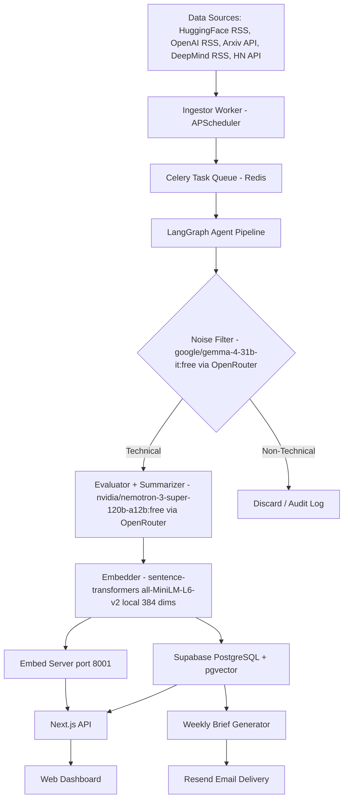

# Technical Architecture: AI Intelligence & News Aggregator

Canonical technical reference for the platform. See [PRD.md](PRD.md) for requirements and [PLAN.md](PLAN.md) for the implementation roadmap.

## 1. System Overview

**Modular Monolith** for the Next.js frontend/API layer + independent **Agentic Pipeline** for data processing. Both services communicate exclusively through the Supabase database — no direct RPC between them. This keeps the worker fully replaceable without touching the frontend.



**Architecture philosophy:** Zero paid API calls during normal operation. LLM inference via OpenRouter free-tier models; embeddings via a local HTTP server backed by sentence-transformers. The entire stack runs free-of-charge — only a free OpenRouter account is required.

## 2. Technology Stack

### Frontend & Core API

| Component | Technology | Notes |
|---|---|---|
| Framework | Next.js 16.2+ (App Router) | Server Actions, Route Handlers, Turbopack |
| Styling | Tailwind CSS v4 + Shadcn/UI | Dark mode default, information-dense layout |
| State Management | TanStack React Query v5 | Optimistic updates, stale-while-revalidate |
| Auth | **None** | Personal single-user app; all routes are public. `OWNER_ID = 'owner'` hardcoded in server routes. |

### Agentic Pipeline (Python Worker)

| Component | Technology | Notes |
|---|---|---|
| Language | Python 3.11+ | Best ecosystem for LLM and scraping libraries |
| Agent Framework | LangGraph 0.2+ | Stateful graph with retry and fallback edges |
| LLM — Categorizer | `google/gemma-4-31b-it:free` via OpenRouter | First-pass technical filter, $0, 256K context |
| LLM — Evaluator + Summarizer | `nvidia/nemotron-3-super-120b-a12b:free` via OpenRouter | Called only on Technical articles, $0, 262K context |
| LLM Client | `openai` Python SDK | Pointed at `https://openrouter.ai/api/v1` — OpenAI-compatible interface |
| Embeddings | `sentence-transformers/all-MiniLM-L6-v2` | Local, 384 dims, ~80MB model cached on disk, no API key |
| Embed HTTP Server | `worker/embed_server.py` on port `8001` | Bridges local sentence-transformers to Next.js `/api/search` |
| HTTP Client | `httpx` + `feedparser` | Async RSS parsing |
| Job Queue Consumer | Celery 5+ (`celery[redis]`) | Handles retries, rate limits, and task concurrency |
| Scheduler | APScheduler | In-process cron for polling each source |
| Observability | Disabled | `LANGCHAIN_TRACING_V2=false`; no external tracing service required |

### Data & Infrastructure

| Component | Technology | Notes |
|---|---|---|
| Primary DB | Supabase (PostgreSQL 15) | Managed, free tier sufficient for MVP |
| Vector Search | pgvector (384 dims) | Co-located with primary DB, no separate vector service |
| Job Queue Broker | Redis (Docker) | Local Docker container (`ai-news-redis`) |
| Email | Resend | 100 emails/day free; optional (weekly brief only) |
| FE Deployment | Vercel (Hobby) | Zero-config, edge CDN |
| Worker Deployment | Railway | Docker container, always-on ~$5–10/month |
| CI/CD | GitHub Actions | Lint, type-check, pipeline integration tests on every PR |

## 3. Database Schema

```sql
-- Enable pgvector
CREATE EXTENSION IF NOT EXISTS vector;

-- Articles ingested and validated by the pipeline
CREATE TABLE news_items (
  id                   UUID PRIMARY KEY DEFAULT gen_random_uuid(),
  source_url           TEXT UNIQUE NOT NULL,
  source_name          TEXT NOT NULL,           -- 'huggingface' | 'openai' | 'arxiv' | 'deepmind' | 'hn'
  title                TEXT NOT NULL,
  raw_content          TEXT,
  technical_summary    TEXT,
  impact_score         SMALLINT CHECK (impact_score BETWEEN 1 AND 10),
  depth_score          SMALLINT CHECK (depth_score BETWEEN 1 AND 10),
  implementation_steps JSONB,                   -- [{"step": 1, "description": "...", "code": "..."}]
  affected_workflows   TEXT[],                  -- e.g. ['RAG Pipelines', 'Agent Orchestration']
  embedding            VECTOR(384),             -- all-MiniLM-L6-v2 (384 dims); set at ingestion
  category             TEXT,                    -- 'Technical' | 'Financial' | 'Political' | 'General'
  tags                 TEXT[],                  -- denormalized tag names for fast list queries
  published_at         TIMESTAMPTZ,
  ingested_at          TIMESTAMPTZ DEFAULT NOW(),
  is_filtered          BOOLEAN NOT NULL DEFAULT FALSE  -- TRUE = passed noise filter, publicly visible
);

-- Controlled vocabulary of technical tags
CREATE TABLE tech_tags (
  id       UUID PRIMARY KEY DEFAULT gen_random_uuid(),
  name     TEXT UNIQUE NOT NULL,               -- 'LangGraph', 'RAG', 'Claude', 'Multi-Agent', etc.
  category TEXT NOT NULL                       -- 'framework' | 'model' | 'methodology' | 'tool'
);

-- Many-to-many: articles <-> tags
CREATE TABLE news_item_tags (
  news_item_id UUID NOT NULL REFERENCES news_items(id) ON DELETE CASCADE,
  tech_tag_id  UUID NOT NULL REFERENCES tech_tags(id)  ON DELETE CASCADE,
  PRIMARY KEY (news_item_id, tech_tag_id)
);

-- Single-owner watchlist (user_id is always 'owner')
CREATE TABLE user_watchlist (
  user_id     TEXT NOT NULL DEFAULT 'owner',
  tech_tag_id UUID NOT NULL REFERENCES tech_tags(id) ON DELETE CASCADE,
  created_at  TIMESTAMPTZ DEFAULT NOW(),
  PRIMARY KEY (user_id, tech_tag_id)
);

-- Email subscribers for the weekly brief (optional)
CREATE TABLE email_subscriptions (
  email      TEXT PRIMARY KEY,
  active     BOOLEAN DEFAULT TRUE,
  created_at TIMESTAMPTZ DEFAULT NOW()
);

-- LLM usage tracking for cost awareness
CREATE TABLE llm_usage_log (
  id            UUID PRIMARY KEY DEFAULT gen_random_uuid(),
  timestamp     TIMESTAMPTZ DEFAULT NOW(),
  model         TEXT NOT NULL,
  input_tokens  INT,
  output_tokens INT,
  job_id        TEXT
);

-- Indexes
CREATE INDEX ON news_items USING ivfflat (embedding vector_cosine_ops) WITH (lists = 100);
CREATE INDEX ON news_items (published_at DESC);
CREATE INDEX ON news_items (impact_score DESC);
CREATE INDEX ON news_items (is_filtered, published_at DESC);
CREATE INDEX ON news_item_tags (tech_tag_id);
CREATE INDEX ON news_item_tags (news_item_id);
```

### Semantic Search RPC

```sql
-- Used by /api/search route via supabase.rpc('match_articles', {...})
CREATE OR REPLACE FUNCTION match_articles(
  query_embedding VECTOR(384),
  match_threshold FLOAT DEFAULT 0.7,
  match_count     INT   DEFAULT 10
)
RETURNS TABLE (
  id                UUID,
  title             TEXT,
  source_name       TEXT,
  technical_summary TEXT,
  impact_score      SMALLINT,
  tags              TEXT[],
  published_at      TIMESTAMPTZ,
  similarity        FLOAT
)
LANGUAGE sql STABLE AS $$
  SELECT
    id, title, source_name, technical_summary,
    impact_score, tags, published_at,
    1 - (embedding <=> query_embedding) AS similarity
  FROM news_items
  WHERE is_filtered = TRUE
    AND 1 - (embedding <=> query_embedding) > match_threshold
  ORDER BY embedding <=> query_embedding
  LIMIT match_count;
$$;
```

### Row Level Security (RLS)

```sql
-- news_items: public read for filtered articles; writes via service role only
ALTER TABLE news_items ENABLE ROW LEVEL SECURITY;
CREATE POLICY "public_read_filtered" ON news_items
  FOR SELECT USING (is_filtered = TRUE);

-- tech_tags: fully public read
ALTER TABLE tech_tags ENABLE ROW LEVEL SECURITY;
CREATE POLICY "public_read" ON tech_tags FOR SELECT USING (TRUE);

-- news_item_tags: public read
ALTER TABLE news_item_tags ENABLE ROW LEVEL SECURITY;
CREATE POLICY "public_read" ON news_item_tags FOR SELECT USING (TRUE);

-- user_watchlist: all access via server-side service role (no client JWT)
ALTER TABLE user_watchlist ENABLE ROW LEVEL SECURITY;
-- No client-facing SELECT policy; reads/writes done via service role key in API routes only.

-- llm_usage_log: no client access; written by worker via service role key only
ALTER TABLE llm_usage_log ENABLE ROW LEVEL SECURITY;
-- No SELECT policy = inaccessible from client. Admin reads via service role.
```

## 4. LangGraph Agent Pipeline

Directed stateful graph with explicit error and discard edges.

```python
from typing import TypedDict, Literal

class PipelineState(TypedDict):
    # Populated by the scraper before the graph runs:
    source_url: str
    source_name: str
    title: str
    raw_content: str
    published_at: str | None
    # After categorizer_node:
    category: Literal["Technical", "Financial", "Political", "General", "Error"]
    # After evaluator_node:
    depth_score: int           # Technical complexity: 1-10
    impact_score: int          # Developer workflow impact: 1-10
    affected_workflows: list[str]
    tags: list[str]            # Tag names matched to tech_tags vocabulary
    # After summarizer_node:
    technical_summary: str
    implementation_steps: list[dict]
    # After embedder_node (local sentence-transformers, 384 dims):
    embedding: list[float]
    error: str | None

# Node responsibilities:
# 1. categorizer_node  -> google/gemma-4-31b-it:free via OpenRouter
#                         Classify category. $0, runs on ALL articles.
#                         Strips markdown code fences from response before JSON parsing.
# 2. evaluator_node    -> nvidia/nemotron-3-super-120b-a12b:free via OpenRouter
#                         Assigns depth_score, impact_score, affected_workflows, tags.
#                         Runs only on Technical articles.
# 3. summarizer_node   -> nvidia/nemotron-3-super-120b-a12b:free via OpenRouter
#                         technical_summary (markdown) + implementation_steps JSON.
#                         CONSTRAINT: only extract code literally present in raw_content.
# 4. embedder_node     -> SentenceTransformer("all-MiniLM-L6-v2") loaded locally (lazy init)
#                         Generates 384-dim embedding. No network call, no API key required.
# 5. storage_node      -> Supabase (service role key): upsert full record, is_filtered=TRUE.
#                         Inserts tags into news_item_tags. Writes to llm_usage_log.
# 6. discard_node      -> Inserts minimal record with is_filtered=FALSE.
# 7. error_node        -> Stores raw article with is_filtered=FALSE.
#                         Raises Celery RetryError (max 3x, exponential backoff).

# Graph edges:
# START -> categorizer_node
# categorizer_node:
#   category == "Technical"  -> evaluator_node
#   category != "Technical"  -> discard_node -> END
# evaluator_node  -> summarizer_node
# summarizer_node -> embedder_node
# embedder_node   -> storage_node -> END
# Any node (on exception) -> error_node -> END
```

**OpenRouter client pattern:**
```python
from openai import OpenAI

def _openrouter() -> OpenAI:
    return OpenAI(
        api_key=os.environ["OPENROUTER_API_KEY"],
        base_url="https://openrouter.ai/api/v1",
    )
```

**Fallback / Graceful Degradation:** If OpenRouter rate-limits or is unavailable, nodes raise a retriable exception. Celery retries up to 3x with exponential backoff (5s, 10s, 20s). After 3 failures the article is stored with `is_filtered = FALSE`. The Next.js dashboard serves previously cached `is_filtered = TRUE` articles uninterrupted.

## 5. Embed Server

`worker/embed_server.py` is a lightweight HTTP server (stdlib `http.server`) that exposes the local sentence-transformers model to the Next.js frontend. No framework, no dependencies beyond sentence-transformers.

| Endpoint | Method | Body | Response |
|---|---|---|---|
| `/health` | GET | — | `{"ok": true}` |
| `/embed` | POST | `{"text": "..."}` | `{"embedding": [0.12, -0.03, ...]}` (384 floats) |

- **Port:** `8001` (configurable via `WORKER_EMBED_URL` in `.env.local`)
- **Model:** `all-MiniLM-L6-v2` — lazy-loaded on first request, kept in memory
- **Used by:** `app/api/search/route.ts` — if unavailable, search returns HTTP 200 with empty results (graceful degradation)
- **Startup:** `python worker/embed_server.py` (with `.venv` activated)

## 6. API Integrations & Scraping Sources

| Source | Endpoint | Auth | Polling Interval |
|---|---|---|---|
| HuggingFace Blog | `https://huggingface.co/blog/feed.xml` | None | Every 30 min |
| OpenAI Blog | `https://openai.com/news/rss.xml` | None | Every 30 min |
| Arxiv (cs.AI, cs.CL) | `https://export.arxiv.org/api/query?search_query=cat:cs.AI+OR+cat:cs.CL&max_results=20&sortBy=submittedDate` | None | Every 60 min |
| Google DeepMind | `https://deepmind.google/blog/rss.xml` | None | Every 30 min |
| Hacker News | `https://hacker-news.firebaseio.com/v0/newstories.json` + top-N filtered by keyword | None | Every 60 min |

### Pipeline Cost Per Article

| Node | Model | Est. Cost/Article |
|---|---|---|
| Categorizer | `google/gemma-4-31b-it:free` (OpenRouter) | **$0** |
| Evaluator | `nvidia/nemotron-3-super-120b-a12b:free` (OpenRouter) | **$0** |
| Summarizer | `nvidia/nemotron-3-super-120b-a12b:free` (OpenRouter) | **$0** |
| Embedder | `all-MiniLM-L6-v2` (local CPU) | **$0** |
| **Total** | | **$0** |

> Free-tier OpenRouter models are subject to rate limits. If limits are hit, Celery retries with exponential backoff. To increase throughput, change the model strings in `worker/pipeline/graph.py` to paid OpenRouter models.

## 7. Frontend Architecture

### Route Structure (App Router)

```
app/
  layout.tsx              # Root layout: QueryProvider, dark mode, Command+K listener
  page.tsx                # /  -> High-density news feed (public, no auth required)
  article/[id]/page.tsx   # /article/:id -> Technical detail view
  search/page.tsx         # /search -> Command+K semantic search results
  watchlist/page.tsx      # /watchlist -> Technology watchlist (OWNER_ID='owner')
  admin/
    usage/page.tsx        # /admin/usage -> LLM token usage dashboard
  api/
    news/route.ts              # GET /api/news -> paginated articles (is_filtered=TRUE)
    search/route.ts            # GET /api/search?q= -> calls embed server -> pgvector similarity
    article/
      [id]/route.ts            # GET /api/article/:id
      [id]/related/route.ts    # GET /api/article/:id/related -> top 5 by vector similarity
    watchlist/route.ts         # GET / POST / DELETE (OWNER_ID='owner', service role key)
    admin/
      usage/route.ts           # GET /api/admin/usage (service role only)
```

### Key Components

- **`NewsFeed`** — Virtualized list of `ArticleCard`, sorted by `impact_score DESC`. Client-side tag filter bar.
- **`ArticleCard`** — Compact card: title, source badge, depth score bar, top 3 tags, relative publish time.
- **`ArticleDetailView`** — Markdown renderer + implementation steps accordion + syntax-highlighted code blocks (`shiki`). Related articles sidebar.
- **`CommandPalette`** — `Command+K` / `Ctrl+K` modal using Shadcn `Command`. Calls `/api/search` with 300ms debounce. Returns graceful empty state if embed server is unavailable.
- **`WatchlistPanel`** — Tag picker with toggle. Writes via API route with hardcoded `OWNER_ID='owner'`.

## 8. Startup & Local Development

### 5-Terminal Startup

```bash
# Terminal 1 — Infrastructure (Supabase local + Redis Docker)
bash setup-docker.sh

# Terminal 2 — Next.js frontend (http://localhost:3000, no login required)
pnpm dev

# Terminal 3 — Local embed server for semantic search (http://localhost:8001)
source worker/.venv/bin/activate
python worker/embed_server.py     # First run downloads ~80MB model, then cached

# Terminal 4 — Celery worker (LangGraph pipeline, requires OPENROUTER_API_KEY)
source worker/.venv/bin/activate
celery -A worker.celery_app.app worker --loglevel=info

# Terminal 5 — APScheduler (RSS/Arxiv scraper cron)
source worker/.venv/bin/activate
python worker/main.py
```

Terminals 4 and 5 require `OPENROUTER_API_KEY` in `worker/.env`. The frontend (terminals 1–3) works fully without it, serving seed/existing data.

### Environment Variables

**`.env.local`** (Next.js):

| Variable | Purpose |
|---|---|
| `NEXT_PUBLIC_SUPABASE_URL` | Supabase local instance URL |
| `SUPABASE_SERVICE_ROLE_KEY` | Service role key for server-side writes |
| `WORKER_EMBED_URL` | Embed server base URL (default: `http://localhost:8001`) |
| `NEXT_PUBLIC_APP_URL` | App base URL |

**`worker/.env`** (Python pipeline):

| Variable | Purpose |
|---|---|
| `SUPABASE_URL` | Supabase URL |
| `SUPABASE_SERVICE_ROLE_KEY` | DB write access |
| `OPENROUTER_API_KEY` | Free key from https://openrouter.ai/keys |
| `CELERY_BROKER_URL` | `redis://localhost:6379/0` |
| `CELERY_RESULT_BACKEND` | `redis://localhost:6379/0` |
| `RESEND_API_KEY` | Optional — weekly email digest only |
| `DAILY_TOKEN_CAP` | Max tokens/day before pipeline auto-pauses (default: 400000) |

## 9. Deployment & CI/CD

### Environments

| Env | Frontend | Worker | Database |
|---|---|---|---|
| Development | `localhost:3000` | Local venv | Supabase CLI local instance |
| Staging | Vercel Preview URL | Railway staging service | Supabase staging project |
| Production | Vercel Production | Railway production service | Supabase production project |

### GitHub Actions

```yaml
# .github/workflows/ci.yml
name: CI
on: [push, pull_request]

jobs:
  frontend:
    runs-on: ubuntu-latest
    steps:
      - uses: actions/checkout@v4
      - uses: pnpm/action-setup@v3
      - run: pnpm install --frozen-lockfile
      - run: pnpm lint && pnpm typecheck

  pipeline:
    runs-on: ubuntu-latest
    steps:
      - uses: actions/checkout@v4
      - uses: actions/setup-python@v5
        with: { python-version: '3.11' }
      - run: pip install -r worker/requirements.txt
      - run: pytest worker/tests/pipeline/ -v
        # Runs sample articles through the noise filter.
        # Asserts: >=95% technical pass rate, <=5% false positives.
```

### Worker Dockerfile

```dockerfile
# worker/Dockerfile
FROM python:3.11-slim
WORKDIR /app
COPY requirements.txt .
RUN pip install --no-cache-dir -r requirements.txt
# Pre-download sentence-transformers model at build time to avoid cold-start delay
RUN python -c "from sentence_transformers import SentenceTransformer; SentenceTransformer('all-MiniLM-L6-v2')"
COPY . .
CMD ["python", "-m", "worker.main"]
```

> In production, deploy `worker/embed_server.py` as a **separate Railway service** so the Next.js frontend can reach it over the network. Set `WORKER_EMBED_URL` in Vercel environment variables to the Railway service URL.

## 10. Security

- **`OPENROUTER_API_KEY`** and **`SUPABASE_SERVICE_ROLE_KEY`** live exclusively as Vercel/Railway environment variables. Never in source code, never in client-side bundles.
- **Supabase Service Role Key** is used **only** in Next.js API routes (server-side) and the Python worker. The anon key (subject to RLS §3) is never used for writes.
- **No auth attack surface** — removing the login system eliminates session fixation, JWT forgery, and credential stuffing vectors. All routes are implicitly internal (personal single-user app).
- **Input sanitization:** All scraped HTML/RSS content is stripped with `bleach.clean(content, tags=[], strip=True)` before being sent to the LLM, preventing prompt injection via article content.
- **Cost cap:** Celery task checks `llm_usage_log` at start. If today's token sum exceeds `DAILY_TOKEN_CAP`, the task raises `celery.exceptions.Ignore()` to drop it without retrying.
- **OpenRouter free-tier:** No credit card required; worst case is a rate-limit error, not an unexpected bill.

## 11. Observability

| Tool | What It Monitors |
|---|---|
| Vercel Analytics | Core Web Vitals, P95 load time for the dashboard |
| Railway Metrics | Worker CPU/memory, job queue depth |
| Supabase Dashboard | Query performance, DB size, pgvector index health |
| `llm_usage_log` table | Daily token count per model (all $0 with free OpenRouter models) |

## 12. Cost Summary

| Service | Cost |
|---|---|
| Supabase | Free ($0) |
| Vercel | Free Hobby ($0) |
| Railway (worker + embed server) | ~$5–10/month |
| Redis (local Docker) | Free ($0) |
| OpenRouter LLM | **Free ($0)** — free-tier models only |
| Embeddings | **Free ($0)** — local sentence-transformers |
| Resend (email digest) | Free ($0) — 100 emails/day |
| **Total** | **~$5–10/month** (Railway only) |
